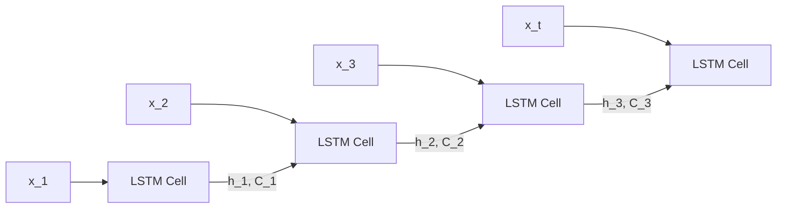

# 2.2.2 长短期记忆网络（LSTM）

循环神经网络适合处理序列数据，但传统循环神经网络在训练过程中容易出现梯度消失或梯度爆炸问题，因此难以学习长距离依赖关系。长短期记忆网络是在循环神经网络基础上提出的改进结构，其核心思想是引入细胞状态 $C_t$ 作为长期信息通道，并通过门控机制控制信息的遗忘、更新和输出，从而提高对长程时序依赖的建模能力。

LSTM 的输入包括当前时刻输入 $x_t$、上一时刻隐藏状态 $h_{t-1}$ 以及上一时刻细胞状态 $C_{t-1}$，输出为当前时刻隐藏状态 $h_t$ 和更新后的细胞状态 $C_t$。其基本结构如图 2-6 所示。

```mermaid
flowchart LR
    X[x_t] --> F[遗忘门]
    H[h_{t-1}] --> F
    X --> I[输入门]
    H --> I
    X --> G[候选状态]
    H --> G
    C1[C_{t-1}] --> U[细胞状态更新]
    F --> U
    I --> U
    G --> U
    U --> C2[C_t]
    X --> O[输出门]
    H --> O
    C2 --> T[Tanh]
    O --> H2[h_t]
    T --> H2
```

图 2-6 LSTM 基本结构示意图

## 1. 门控机制

LSTM 主要包含遗忘门、输入门和输出门三个门控单元。

### 1.1 遗忘门

遗忘门用于决定上一时刻细胞状态中哪些信息需要保留，其计算公式为：

遗忘门的计算公式为：

$$
f_t = \sigma\left(W_f [h_{t-1}, x_t] + b_f\right)
$$

### 1.2 输入门

输入门用于决定当前时刻有哪些新信息需要写入细胞状态，其计算分为两步：

输入门权重的计算公式为：

$$
i_t = \sigma\left(W_i [h_{t-1}, x_t] + b_i\right)
$$

候选细胞状态的计算公式为：

$$
\tilde{C}_t = \tanh\left(W_C [h_{t-1}, x_t] + b_C\right)
$$

### 1.3 细胞状态更新

在遗忘门和输入门共同作用下，细胞状态更新为：

$$
C_t = f_t \odot C_{t-1} + i_t \odot \tilde{C}_t
$$

### 1.4 输出门

输出门用于决定当前细胞状态中哪些信息用于生成隐藏状态，其公式为：

$$
o_t = \sigma\left(W_o [h_{t-1}, x_t] + b_o\right)
$$

随后，结合当前细胞状态计算隐藏状态 $h_t$：

$$
h_t = o_t \odot \tanh(C_t)
$$

由上述公式可见，LSTM 通过门控结构实现“保留有用历史信息、引入当前有效信息并输出当前状态”的动态更新过程，从而增强了对长距离时序依赖的建模能力。

## 2. 时序展开过程

LSTM 在时间维度上的展开如图 2-7 所示。网络在每个时间步重复相同结构，通过隐藏状态和细胞状态不断传递历史信息，从而实现对整个序列的建模。



图 2-7 LSTM 时间展开示意图

## 3. LSTM 在房颤检测中的作用

房颤的重要特征是 RR 间期序列的绝对不规则，这种变化通常体现在较长时间尺度上的节律紊乱。LSTM 能够利用门控机制有选择地保留长期节律信息，同时抑制短期随机波动，因此适合用于建模房颤的时序演变特征。

在本文中，LSTM 主要用于弥补卷积神经网络在长程时序依赖建模方面的不足。CNN 更擅长提取局部波形形态特征，而 LSTM 更擅长提取节律变化特征，二者结合能够更全面地表示 ECG 信号。

## 4. LSTM 的优势与局限性

LSTM 的主要优势在于能够缓解传统循环神经网络中的梯度消失问题，并较好地学习长距离时序依赖，因此在节律类医学信号分析中具有较强适用性。

但与此同时，LSTM 仍然属于循环结构，训练过程难以完全并行化，计算效率相对较低；当输入序列特别长时，其长期记忆能力仍可能受到限制。因此，在实际应用中，常常需要将 LSTM 与 CNN、Transformer 等结构结合使用，以兼顾局部特征提取能力和长程依赖建模能力。

## 5. 本节小结

本节简要介绍了长短期记忆网络的基本原理。LSTM 通过遗忘门、输入门和输出门控制细胞状态的更新与传递，能够有效增强对长程时序依赖的建模能力。在房颤检测任务中，LSTM 对节律紊乱模式具有较好的表达能力，但其训练效率和超长序列建模能力仍存在一定限制，因此通常需要与其他结构结合使用。