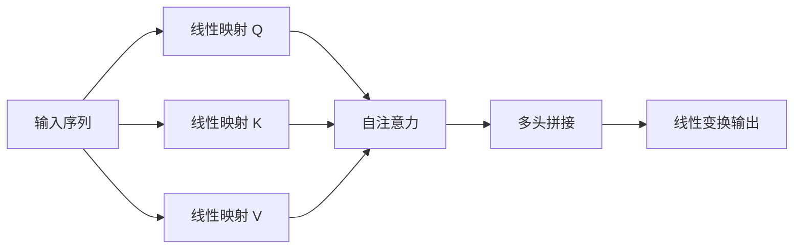

# 2.2.3 Transformer 架构与注意力机制

Transformer 是一种完全基于注意力机制的序列建模架构。与循环神经网络不同，Transformer 不依赖时间步递归传播信息，而是通过自注意力机制直接建模序列中任意两个位置之间的依赖关系，因此在处理长距离依赖问题时具有明显优势。

## 1. 注意力机制原理

注意力机制的核心思想是：在生成某一位置输出时，动态关注输入序列中与当前任务最相关的部分。给定查询矩阵 $Q$、键矩阵 $K$ 和值矩阵 $V$，注意力输出可表示为：

$$
Attention(Q, K, V) = Softmax\left(\frac{QK^T}{\sqrt{d_k}}\right)V
$$

其中，$d_k$ 表示键向量维度，缩放因子 $\sqrt{d_k}$ 用于避免点积过大，导致 Softmax 进入梯度饱和区。该公式表明，注意力机制本质上是先计算查询与键之间的相似度，再对值进行加权求和，从而得到当前时刻的特征表示。

## 2. 自注意力与多头注意力

自注意力是注意力机制的一种特殊形式，其中 $Q$、$K$、$V$ 都来自同一输入序列的不同线性变换。它能够直接学习序列内部不同位置之间的关系，因此特别适合处理具有长程依赖特征的序列数据。

为增强模型表达能力，Transformer 引入多头注意力机制，即将输入映射到多个不同的低维子空间中，并行执行多组注意力计算，最后再将结果拼接并线性变换。这样，不同注意力头可以关注序列中的不同信息模式。例如，在心电序列分析中，某些注意力头可能关注相邻心拍之间的局部关系，而另一些注意力头则可能关注相隔较远心拍之间的长期节律关联。

其基本过程如图 2-8 所示。

图 2-8 Transformer 自注意力结构示意图

## 3. 位置编码

由于 Transformer 本身不包含循环结构或卷积结构，因此不能像循环神经网络那样天然感知序列顺序。为使模型能够识别序列中元素的先后关系，需要显式加入位置编码。

常用的正弦位置编码形式为：

$$
PE(pos, 2i) = \sin\left(\frac{pos}{10000^{2i/d}}\right)
$$

$$
PE(pos, 2i+1) = \cos\left(\frac{pos}{10000^{2i/d}}\right)
$$

其中，$pos$ 表示位置索引，$i$ 表示编码维度索引，$d$ 表示位置编码总维数。通过这种方式，模型能够感知样本在时间轴上的顺序及相对距离关系。

## 4. Transformer 在房颤检测中的作用

房颤的重要特征之一是长程节律紊乱，自注意力机制能够直接建立任意两个心拍之间的联系，因此理论上比传统循环网络更适合捕捉长距离依赖关系。同时，Transformer 采用并行计算结构，训练效率通常高于 LSTM 这类循环模型。

但是，Transformer 也存在明显局限性。其自注意力计算复杂度随序列长度呈平方级增长，因此在处理长时程心电信号时计算开销较大；此外，Transformer 通常对数据规模要求较高，在小样本或少标注场景下更容易出现过拟合问题。

## 5. 本文为何未将 Transformer 作为核心模型

综合考虑任务特点与实验条件，本文没有将 Transformer 作为核心建模结构，主要基于以下原因：

1. 本文研究面向低标注场景，训练数据规模相对有限，而 CNN 与 LSTM 在中小规模数据上通常更稳定。
2. 可穿戴设备和实时检测场景对计算资源要求较高，CNN 与 LSTM 在当前任务中的计算成本相对更可控。
3. CNN 擅长提取局部波形特征，LSTM 擅长建模节律变化，二者互补性较强，更适合构建本文的异构协同框架。

因此，Transformer 在本文中更多作为相关理论基础进行介绍，为后续进一步扩展模型结构提供参考方向。

## 6. 本节小结

本节简要介绍了 Transformer 架构与注意力机制的基本原理，包括自注意力、多头注意力和位置编码。Transformer 能够直接建模长距离依赖，并具有较高并行计算效率，在长程时序分析任务中具有明显优势。但由于其计算开销较大、对数据规模要求较高，本文最终选择 CNN 与 LSTM 作为核心模型组件，而将 Transformer 相关理论作为后续模型扩展的重要参考。