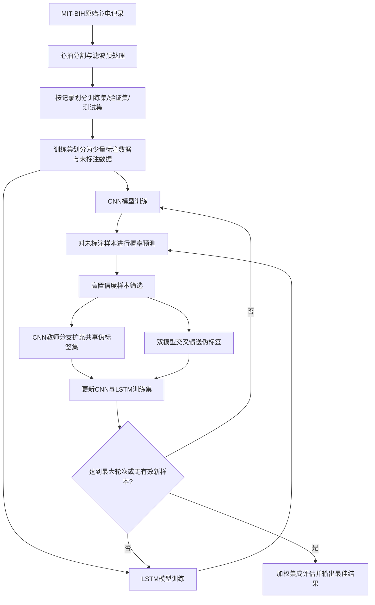

# 3.1 算法整体框架设计

## 3.1.1 设计目标

针对心电信号异常检测任务中标注样本获取成本高、类别分布不均衡以及单一模型泛化能力受限等问题，本文设计了一种基于 CNN 与 LSTM 双模型协同的交互式半监督学习框架。该方法以少量真实标注样本作为初始监督信息，以大量未标注样本作为伪标签扩充对象，通过卷积神经网络与时序递归网络之间的双向知识交互，不断提升模型对异常心拍的识别能力。

该框架的核心思想包括以下三点：

1. 采用按记录划分的数据隔离策略，避免同一受试者心拍同时出现在训练集与验证集、测试集中，从而降低数据泄露风险。
2. 利用 CNN 的局部形态特征提取能力与 LSTM 的时序依赖建模能力构建异构学习器，实现模型间互补。
3. 通过高置信度伪标签筛选、动态阈值调节和双模型交叉馈送机制，逐轮扩充训练集，提升半监督学习的稳定性与准确性。

## 3.1.2 整体框架

本文算法整体流程由数据预处理、初始标注集构建、双模型监督训练、未标注样本伪标签生成、跨模型交互筛选以及多轮迭代优化六个部分组成。整体框架如图示逻辑所示。

从实现角度看，该框架首先调用数据处理模块生成固定长度心拍片段，再按照记录编号完成训练集、验证集和测试集划分。随后，仅使用训练集中的一部分样本作为初始标注集，其余样本视为未标注数据。算法在每一轮中分别训练 CNN 和 LSTM 两个模型，并基于两者在未标注样本上的预测结果筛选新的伪标签样本，将其加入下一轮训练过程，直至满足停止条件。

## 3.1.3 数据预处理与数据划分策略

本文采用 MIT-BIH 心律失常数据库作为实验数据源。首先对原始 ECG 信号进行滤波处理，以减弱基线漂移和噪声干扰；随后根据心拍标注位置截取固定长度的心拍片段，并对片段进行标准化，使不同记录之间的幅值差异尽可能减小。经过这一处理后，原始连续心电记录被转化为可直接输入深度学习模型的一维样本序列。

在标签构建上，本文将正常心拍与异常心拍归并为二分类任务，其中正常类记为 0，异常类记为 1。这样的处理既保留了异常检测任务的核心目标，也有利于在少量标注条件下稳定开展半监督学习。

在数据划分上，本文采用按记录划分而非按样本随机划分的方式，将数据分为训练集、验证集和测试集。这样可以保证同一条记录中的心拍不会同时出现在不同数据子集中，从而减少数据泄露问题，使实验结果更能反映模型对未知个体的泛化能力。

在训练集内部，再抽取少量样本作为初始标注数据，其余样本作为未标注数据参与后续伪标签学习。由此构建出“少量标注样本 + 大量未标注样本”的半监督学习场景，为后续双模型交互迭代提供基础。

## 3.1.4 双模型协同学习结构设计

### 1. CNN 分支

CNN 分支主要负责提取 ECG 信号的局部形态特征。模型由四层一维卷积网络组成，每层后接批归一化、非线性激活与池化操作。随着网络加深，卷积核感受野不断扩大，模型能够从原始波形中逐步提取由局部到全局的层次化特征。最后，通过自适应平均池化和全连接层输出二分类概率。

该分支的优势在于：

1. 能够有效捕获 QRS 波群、P 波及 T 波等局部形态变化。
2. 参数共享机制使其对噪声具有较好的鲁棒性。
3. 计算效率较高，适合作为伪标签生成中的主教师模型。

### 2. LSTM 分支

LSTM 分支首先通过卷积特征提取器对输入信号进行初步编码，然后将卷积特征序列输入双向 LSTM 网络，以建模前后时序依赖关系。为了进一步提升特征表达能力，模型还融合了最后时刻隐藏状态、均值池化、最大池化和注意力池化等多种时序统计特征，最终通过全连接层完成分类。

该分支的优势在于：

1. 能够建模心电片段中的时序演化规律。
2. 双向结构可同时利用前向与后向上下文信息。
3. 注意力机制有助于突出关键时间位置，提高异常识别敏感性。

### 3. 双模型互补性

CNN 更擅长捕获局部波形形态，而 LSTM 更擅长建模时序动态信息。将两者结合后，可以从不同视角分析 ECG 信号，从而提升伪标签筛选的可靠性与最终集成性能。基于这种互补性，本文没有采用单模型自训练，而是设计了双模型交互式半监督学习策略。

## 3.1.5 交互式半监督学习机制

本文方法的核心在于双模型交互式伪标签学习。每一轮迭代中，CNN 和 LSTM 先基于当前训练集分别完成训练，然后共同对未标注样本进行预测。与传统单模型自训练不同，本文不是直接将所有预测结果加入训练集，而是只保留置信度较高、可靠性较强的样本，从而尽量控制伪标签噪声。

在具体设计上，CNN 作为主要教师模型，优先从未标注数据中筛选出高可信样本，并将其加入共享伪标签集合，供两个模型共同使用。在此基础上，再利用 CNN 与 LSTM 之间的预测一致性进行交叉馈送，使两个模型能够从彼此擅长的特征视角中获取补充信息。

为了避免错误伪标签在模型之间不断传播，本文在交互过程中加入了动态约束机制。例如，随着迭代轮次推进，样本筛选条件会适度调整；当某一模型当前性能不足时，其向另一模型提供伪标签的能力会受到限制。通过这些设计，算法在保证样本利用率的同时，也尽量维持了训练过程的稳定性。

此外，训练阶段还结合了适度的数据增强策略，以提升模型对噪声扰动和波形变化的适应能力。这样既可以缓解少量标注样本带来的过拟合风险，也有助于提高后续伪标签筛选的可靠性。

## 3.1.6 集成决策与结果选择

为进一步提高分类结果的稳定性，本文在每一轮训练结束后对 CNN 和 LSTM 的输出进行加权融合。权重分配主要参考两个模型在验证集上的表现，使性能更优的模型在最终决策中占据更大比重。这样的设计可以综合利用两类模型的优势，减少单一模型判断失误带来的影响。

在结果选择上，算法会记录各轮迭代的验证结果和测试结果，并从中选出综合表现最优的一轮作为最终输出。这样既能反映交互式半监督学习在不同轮次下的性能变化，也有助于确定最合适的训练终点。

## 3.1.7 算法执行流程

从整体上看，本文算法可以概括为以下几个阶段：首先对原始 ECG 数据进行预处理与数据划分，构建少量标注样本和大量未标注样本组成的训练场景；其次分别训练 CNN 和 LSTM 两个模型，获得对未标注样本的预测结果；然后通过高置信度筛选和双模型交互机制逐步扩充伪标签数据集；最后对两个模型进行集成，并选择表现最优的迭代轮次作为最终结果。

因此，整个框架体现出“少量标注启动、多轮交互优化、双模型集成决策”的基本设计思路。这一思路也是本文后续实验设计和结果分析的基础。

## 3.1.8 本章方法特点总结

与传统单模型伪标签方法相比，本文提出的算法整体框架具有以下特点：

1. 采用记录级隔离划分策略，实验设置更严格，结果更具可信度。
2. 结合 CNN 与 LSTM 两类异构网络，实现形态特征与时序特征的联合建模。
3. 设计了共享伪标签与专属伪标签并存的交互式学习机制，增强了未标注样本利用效率。
4. 通过动态阈值、最小样本数约束和性能门控策略，有效降低了错误伪标签传播风险。
5. 通过验证集性能自适应分配集成权重，进一步提升了整体识别性能。

综上，本文算法不是简单的伪标签自训练方法，而是一种面向 ECG 异常检测任务的双模型交互式半监督学习框架。该框架在保证训练稳定性的同时，能够逐轮挖掘未标注样本中的有效信息，为后续实验结果分析与性能对比提供了统一的算法基础。